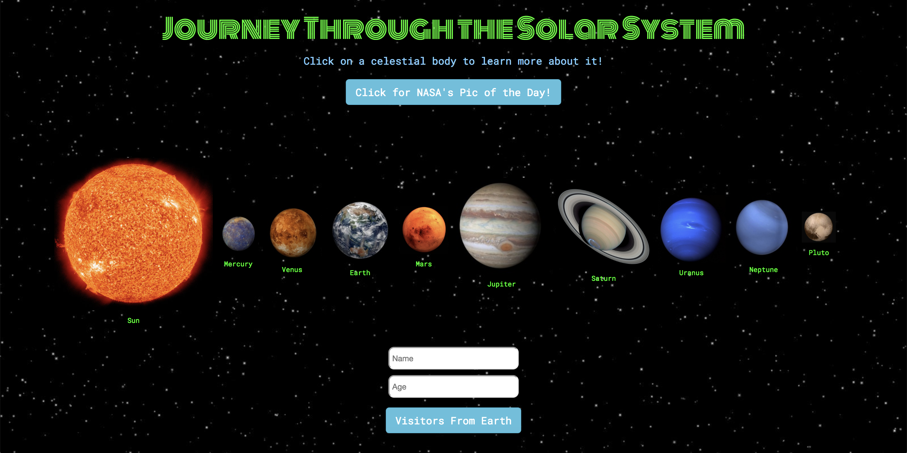

# Journey Through the Solar System

Experience a fun, interactive, and educational journey through the solar system!

Experience here: [Journey Through the Solar System](https://brijamfitz.github.io/Solar-System/)

**Application Walkthrough**
* User can interact with the sun and all nine planets (yes, Pluto is included!) in our solar system!
* Clicking on one of the celestial bodies will display a modal with relavant information about each planet
* There is a button that will display NASA's picture of the day, along with detailed caption
* A user can also enter their name and age to find out how old they would be (in Earth years) on every planet!

**Additional tech used:**
* Wolfram Alpha API
* NASA API
* Chart.js
* Firebase

&nbsp;

Designed and built by the following developer team:
* Chandra Raharja
* Ryan Jae
* Brian Fitzgerald

Maintained by Brian Fitzgerald

Email: brianjfitzgerald@gmail.com

Copyright &#169; 2018